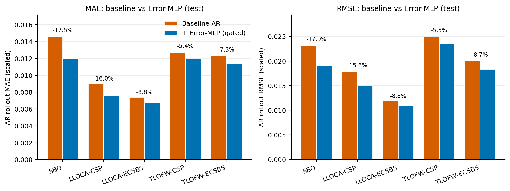
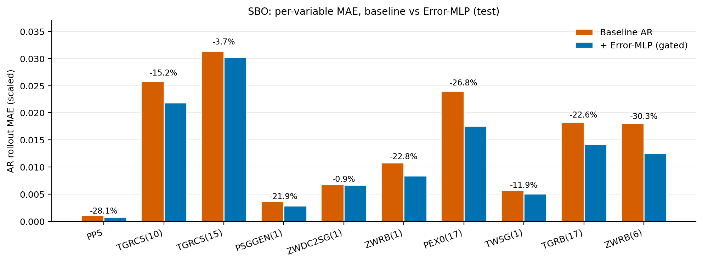
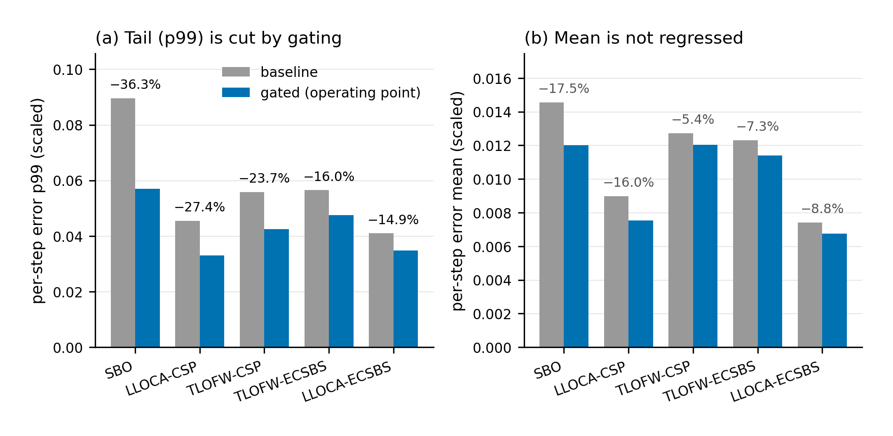
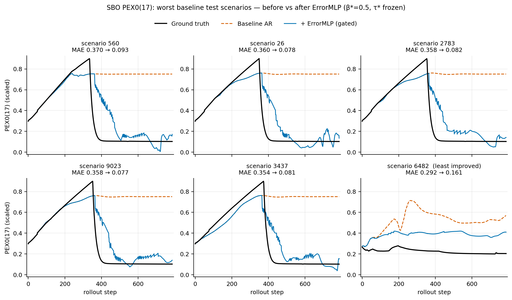
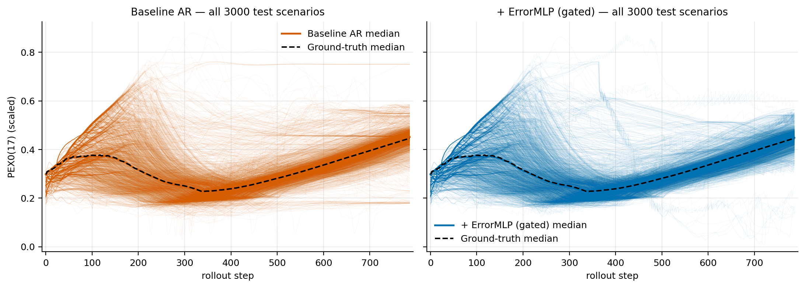
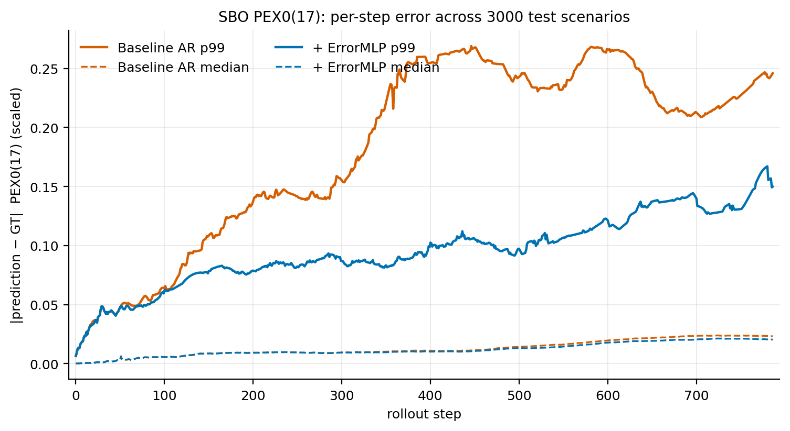

# Error-MLP: Selective Autoregressive Error Correction for ABC-Transformer

Follow-up to **[ABC-Transformer](https://github.com/POSTECH-NINE/abc-transformer)**, the
decoder-only Transformer surrogate for severe-accident progression. ABC-Transformer is trained
one step ahead (teacher forcing) and deployed as an autoregressive (AR) rollout. In the rollout,
small one-step errors are fed back and occasionally compound into large deviations.

This repository keeps the ABC-Transformer backbone **frozen** and attaches a small
**Error-MLP corrector** that predicts the backbone's next-step error. The corrector is applied only on the
few rollout steps where it predicts a large error. The goal is to cut the **rare, large (tail) AR errors**
without hurting the average accuracy of an already strong backbone.

Covered: the five APR1400 per-accident backbones released with ABC-Transformer.
These are **SBO**, **LLOCA-CSP**, **LLOCA-ECSBS**, **TLOFW-CSP** and **TLOFW-ECSBS**
(Δt = 5 min, lookback k = 50, 10 continuous channels plus 4–5 SAMG binaries as known inputs).

Model weights: **[Google Drive folder](https://drive.google.com/drive/folders/1soFQC-1DXXeePR3q_8CfbhDNvLJQwY5v?usp=sharing)**
(see `weights_manifest.csv` for the index and checksums).

---

## 1. Role of this repository

| | ABC-Transformer (parent repo) | This repo (follow-up) |
|---|---|---|
| Question | Can a Transformer emulate MAAP accident trajectories? | Can the AR rollout's *rare large errors* be suppressed without retraining? |
| Model | Decoder-only backbone, trained end to end | Same backbone, frozen, plus Error-MLP corrector and gate |
| Main metric | Mean MAE / RMSE over the rollout | **Tail** of per-step error (p99, worst scenarios), with mean as a do-no-harm guard |
| Exposure-bias fix | Scheduled sampling on OPR1000 (`train_ss.py`) | Post-hoc correction (DAgger-trained) and scheduled sampling on the APR1400 SBO backbone |

---

## 2. Method

### 2.1 Error-MLP corrector

For rollout step $t$ the frozen backbone predicts $\hat y_t$. The corrector $g_\phi$ predicts the
backbone's one-step error from

$$z_t = [\hat y_t\ (10),\ \text{last observed continuous state}\ (10),\ \text{current controls}\ (4\text{–}5),\ t/1000]$$

It is trained on the target $y_t - \hat y_t$ with a tail-weighted SmoothL1 loss. The training data is collected on the
corrector's own rollout distribution with **2-round DAgger** (`error_mlp_dagger.pt`). The
corrected value is **fed back into the window**, so a correction also stops error accumulation.

### 2.2 Selective (gated) correction

$$\hat y^{\text{corr}}_t = \hat y_t + \mathbb 1\big[\lVert g_\phi(z_t)\rVert_2 > \tau\big]\cdot\beta\, g_\phi(z_t)$$

The correction is applied only when the predicted error norm exceeds a threshold τ. At β = 0 the
rollout is bit-identical to the baseline, which serves as a built-in null check.
Correcting *every* step (global correction) adds noise to the many easy steps of a strong
backbone. Global correction worsens the mean monotonically in β in all five cells; for SBO at β = 0.5 the mean rises
by +150% and p99 by +30%. Gating avoids this.

### 2.3 Operating-point protocol (test-clean)

1. Candidate grid: β ∈ {0.5, 1.0} × nominal gate fraction q ∈ {0.005, 0.01, 0.02, 0.05, 0.10}.
2. **Select on validation** (held-out training scenarios the corrector never saw):
   minimise p99 subject to mean ≤ baseline mean.
3. **Freeze** τ\* from validation and evaluate **once** on the test set.

The frozen operating points ship in `weights/error_mlp/op_val_select_summary.json`.

### 2.4 Scheduled-sampling backbone (APR1400 SBO)

`src/experiments/train_backbone_ss_scratch.py` retrains the SBO backbone **from scratch** with
scheduled sampling, keeping the original architecture, optimizer and update budget:

- detached feedback with unroll H = 10;
- feedback probability ramped 0 → 0.5;
- checkpoint selected on validation AR MAE.

`ss_scratch_4way_eval.py` then compares four arms on the same test set: baseline,
baseline + Error-MLP, SS backbone and SS backbone + Error-MLP.
Warm-start AR-aware fine-tuning of the existing backbone (`train_backbone_arbb.py`) was also
tested and found to **worsen** AR error (+30% to +336% AR-MAE on TLOFW-CSP, 7 configurations).
The converged backbone sits at a fragile AR optimum, which is why the scheduled-sampling backbone is trained from scratch.

---

## 3. Results (TEST, validation-selected frozen operating point)

All results use the adopted DAgger corrector at the frozen operating point of each cell (Section 2.3).

### 3.1 Mean accuracy: MAE / RMSE before and after

The metric definitions match ABC-Transformer: macro over test scenarios and 10 continuous channels, with
RMSE taking the root inside the time average. Units are normalized (0.1–0.9).

| Cell | test scen. | MAE baseline → Error-MLP | Δ | RMSE baseline → Error-MLP | Δ |
|---|---|---|---|---|---|
| SBO | 3,000 | 0.01455 → 0.01200 | **−17.5%** | 0.02315 → 0.01901 | **−17.9%** |
| LLOCA-CSP | 1,500 | 0.00899 → 0.00755 | **−16.0%** | 0.01791 → 0.01512 | **−15.6%** |
| LLOCA-ECSBS | 1,500 | 0.00740 → 0.00675 | −8.8% | 0.01193 → 0.01088 | −8.8% |
| TLOFW-CSP | 1,500 | 0.01273 → 0.01203 | −5.4% | 0.02487 → 0.02354 | −5.3% |
| TLOFW-ECSBS | 1,500 | 0.01231 → 0.01140 | −7.3% | 0.02004 → 0.01830 | −8.7% |



Per variable (SBO), every channel improves. The largest gains are on the variables that drive the
worst scenarios: `ZWRB(6)` −30.3%, `PEX0(17)` −26.8%, `TGRB(17)` −22.6%, `ZWRB(1)` −22.8%.
The hot-leg gas temperature `TGRCS(15)`, the hardest output, improves least (−3.7%).



### 3.2 Tail error: p99 and worst scenarios

Per-step error $e_{s,t} = \frac1{10}\sum_k |\hat y_{s,t,k} - y_{s,t,k}|$, pooled over all
scenarios and steps (normalized 0.1–0.9 units). "Fire rate" is the realized fraction of test steps the
gate corrected.

| Cell | β\* | q\* | p99 baseline → gated | **p99 Δ** | mean baseline → gated | mean Δ | worst-10 scen. Δ | fire rate |
|---|---|---|---|---|---|---|---|---|
| SBO | 0.5 | 0.10 | 0.0895 → 0.0570 | **−36.3%** | 0.01455 → 0.01200 | −17.5% | −25.4% | 0.27% |
| LLOCA-CSP | 1.0 | 0.10 | 0.0455 → 0.0330 | **−27.4%** | 0.00899 → 0.00755 | −16.0% | −37.3% | 0.22% |
| LLOCA-ECSBS | 1.0 | 0.05 | 0.0409 → 0.0348 | **−14.9%** | 0.00740 → 0.00675 | −8.8% | −48.0% | 0.45% |
| TLOFW-CSP | 1.0 | 0.01 | 0.0558 → 0.0425 | **−23.7%** | 0.01273 → 0.01203 | −5.4% | −12.5% | 0.03% |
| TLOFW-ECSBS | 1.0 | 0.05 | 0.0565 → 0.0475 | **−16.0%** | 0.01231 → 0.01140 | −7.3% | −36.8% | 0.06% |

Correcting **under 0.5% of the steps** cuts the tail by 15–36% in every cell, and the mean
improves as well.



### 3.3 Trajectories before and after: SBO, `PEX0(17)`

`PEX0(17)` is the dominant driver of SBO's worst-scenario errors (≈19% of the error mass in the
20 worst baseline scenarios). Test set: 3,000 scenarios × 787 rollout steps.

| `PEX0(17)` | Baseline (backbone only) | + Error-MLP | Δ |
|---|---|---|---|
| MAE | 0.02402 | 0.01758 | −26.8% |
| p99 of \|error\| | 0.2058 | 0.0978 | **−52.5%** |
| max \|error\| | 0.750 | 0.514 | −31.5% |
| mean of the 10 worst scenarios | 0.3396 | 0.0812 | **−76.1%** |
| scenarios improved / worsened / unchanged | | 1190 / 568 / 1242 | |

**Worst baseline scenarios.** In these scenarios the true `PEX0(17)` rises to ≈0.9 and then drops sharply to
≈0.1 around step 340–370. The baseline misses the turning point and freezes at ≈0.75. With the
corrector the rollout follows the descent and returns to ≈0.1–0.2, although it lags by 50–100 steps and shows
gate-switching ripples. Scenario 6482 is the least-improved of the worst ten: the corrector removes the
spike, but a ≈0.2 offset remains.



**All 3,000 test scenarios.** The baseline's stuck-at-0.75 bundle largely disappears after correction,
while the median trajectory is untouched. The corrector edits the outliers, not the bulk.



**Per-step error.** p99 is identical up to step ≈100. Afterwards the baseline p99 grows to 0.25–0.27,
while the corrected p99 stays at 0.08–0.15. The median error is essentially unchanged.



### 3.4 Scheduled-sampling backbone (SBO)

From-scratch SS training of the SBO backbone and the four-arm comparison are **in progress**.
This section will be updated with the results.

---

## 4. Released weights

Download `Error_MLP_weights.zip` from the Drive folder above and unzip it in the repo root (it creates `weights/`):

```
weights/
├── backbones/                         # frozen ABC-Transformer APR1400 backbones (best val ckpt)
│   ├── SBO_seq50_pred1/
│   │   ├── config_used.yaml
│   │   └── transformer_decoder_wonung_checkpoints_absolute/epoch=12-val_loss=...ckpt
│   ├── LLOCA_CSP_seq50_pred1/   LLOCA_ECSBS_seq50_pred1/
│   └── TLOFW_CSP_seq50_pred1/   TLOFW_ECSBS_seq50_pred1/
└── error_mlp/                         # adopted 2-round DAgger correctors (≈30 KB each)
    ├── SBO/error_mlp_dagger.pt   LLOCA_CSP/ ...   TLOFW_ECSBS/
    └── op_val_select_summary.json     # frozen (β*, q*, τ*) per cell + validation/test numbers
```

| Cell | backbone (d_model / heads / layers) | params | ckpt |
|---|---|---|---|
| SBO | 64 / 4 / 8, dropout 0 | 0.20 M | 2.6 MB |
| LLOCA-CSP, LLOCA-ECSBS | 128 / 8 / 10, dropout 0.1 | 0.83 M | 10.2 MB |
| TLOFW-CSP, TLOFW-ECSBS | 128 / 8 / 4, dropout 0.1 | 0.34 M | 4.1 MB |

The backbones are the same checkpoints as the ABC-Transformer APR1400 release, re-packaged in the
directory layout this code expects (`load_frozen_backbone_acc` reads `<run_dir>/config_used.yaml`
plus the best `epoch=*.ckpt` in `<run_dir>/transformer_decoder_wonung_checkpoints_absolute/`).

---

## 5. Repository layout & usage

```
src/
├── train.py, predict.py, predict_batched.py   # ABC-Transformer training / inference
├── model_selector.py, models/                 # backbone registry (trnasformer_decoder = ABC-Transformer)
│   └── error_mlp.py                           # Error-MLP corrector
├── dataset.py, accident_dataset.py, utils.py  # windowed datasets, config loading
├── error_rollout_acc.py                       # AR rollout: baseline / global / gated correction
├── error_rollout_arbb.py, error_rollout_unroll.py
├── configs/
│   ├── error_mlp_accident.yaml                # per-cell paths + Error-MLP hyperparameters
│   └── transformer_decoder.yaml, ...          # backbone configs
└── experiments/
    ├── train_error_mlp_acc.py                 # train Error-MLP (+ DAgger rounds)
    ├── eval_error_mlp_acc.py                  # global-β sweep + gated evaluation
    ├── op_val_select_test_eval.py             # select (β,q,τ) on validation, freeze, test once
    ├── tail_analysis_acc.py                   # tail metrics helpers
    ├── plot_cell_metrics.py                   # MAE/RMSE bar charts (baseline vs Error-MLP)
    ├── plot_trajectories.py, plot_before_after.py
    ├── train_backbone_ss_scratch.py           # from-scratch scheduled-sampling backbone
    ├── ss_scratch_4way_eval.py, plot_4way_pex.py
    └── train_backbone_arbb.py, eval_backbone_ood.py   # warm-start AR-aware fine-tune (negative result)
```

Requires Python ≥ 3.10: `pip install -r requirements.txt`.

1. **Paths.** In `src/configs/error_mlp_accident.yaml`, set the absolute paths for your machine:
   - `run_dir` → `<repo>/weights/backbones/<CELL>_seq50_pred1`
   - `train_csv` / `test_csv` → your scaled CSVs
   - `out_root` → `<repo>/outputs`; `cache_dir` → `<repo>/outputs/_window_cache`
   - To use the released correctors, copy `weights/error_mlp/*` into `outputs/`
     (or point `out_root` at `weights/error_mlp`).

   Local working folders (all gitignored):

   ```
   <repo>/weights/   # released weights (Drive)
   <repo>/outputs/   # training / evaluation outputs
   <repo>/release/   # zipped weights for upload
   ```
2. **Evaluate the released corrector** (from `src/`, `NONINTERACTIVE=1`):
   ```bash
   python experiments/op_val_select_test_eval.py --cell SBO
   python experiments/plot_cell_metrics.py                                # MAE/RMSE bars, Section 3.1
   python experiments/plot_before_after.py --cell SBO --var "PEX0(17)"   # trajectories, Section 3.3
   ```
3. **Train a corrector**:
   ```bash
   python experiments/train_error_mlp_acc.py --cell SBO --loss tail_weighted --dagger-rounds 2
   ```
   Pass `--run-dir <dir>` to attach a corrector to a different backbone.
4. **Scheduled-sampling backbone**:
   ```bash
   python experiments/train_backbone_ss_scratch.py --cell SBO
   ```

Datasets (MAAP-generated CSVs) are not redistributed; see the ABC-Transformer README for the
format and the data-availability statement.

---

## 6. Scope and caveats

- All numbers are in normalized (0.1–0.9 min–max) units, from a single corrector seed per cell.
- The backbone is frozen. The corrector is cell-specific and is not claimed to transfer across accidents
  or plants.
- Gains concentrate in the tail. Per scenario, the corrector can also make things slightly worse (SBO
  `PEX0(17)`: 568 of 3,000 test scenarios worsen), so reliability should be judged at the
  distribution level.
- The operating point is selected on validation scenarios held out from the corrector. These scenarios may still have
  been seen during the original backbone training or model selection.

## Citation

If you use the backbone, please cite ABC-Transformer (see its `CITATION.cff`):

> W. Jeong, S. Khanal, J. Lee, S. Lee, J. Jeon, *Enhancing Resolution and Reliability
> with Attention Mechanisms in Nuclear Accident Surrogate Modeling*,
> Reliability Engineering & System Safety (under revision).
